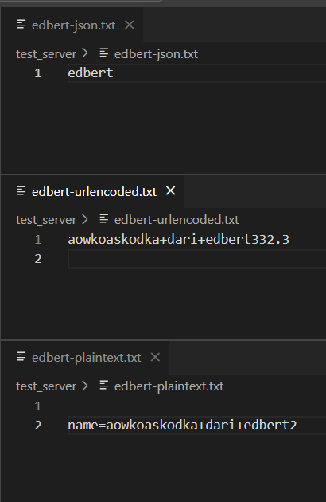

# Web Server using C

## Warning
Development Server. Do Expect a Lot of BUG

-#skill isu :V

> Developed imitationg the behaviour of Python FLASK
>
> Main Source Reference: https://www.youtube.com/@eom-dev/videos
>
> **with lots of EDIT**

## Basic Usage
This is how to use the web server
```C
#include "../HTTPServer.h"
#include "../HTTPResponse.h"
#include "../Systems/Files.h"
#include <stdio.h>
#include <stdlib.h>
#include <string.h>
#include <unistd.h>

char *root_folder = "/mnt/c/Users/Asus Tuf Gaming/Documents/Github Desktop/Seleksi-Laboratorium-Sistem-Terdistribusi-2024/10-Sister-js/test_server/";

char *template(struct HTTPServer *server, struct HTTPRequest *request){
    char index[3000] = {0};

    strcpy(index, root_folder);

    strcat(index, "template.html");

    /* CARA PERTAMA bisa manual */
    struct Dictionary var_to_substitute;
    // var_to_substitute = dictionary_constructor(compare_string_keys);
    // var_to_substitute.insert(&var_to_substitute, "name", strlen("name"), "edbert", strlen("edbert"));
    // var_to_substitute.insert(&var_to_substitute, "gender", strlen("gender") , "boy", strlen("boy"));

    /* CARA KEDUA ambil dari request param langsung */
    var_to_substitute = request->query_params;

    // get files needed
    char *body = render_template(index, &var_to_substitute);

    // char *header = "HTTP/1.1 200 OK\r\nServer: Apache/2.2.14 (Win32)\r\nConnection:Closed\r\n";

    // create final response
    char *accept = request->header_fields.search(&request->header_fields, "Accept", strlen("Accept"));
    struct HTTPResponse *final_response = create_response(200, accept);

    char *x = parse_response_struct(final_response, body);

    return x;
}

char *leak_dict(struct HTTPServer *server, struct HTTPRequest *request){
    char *accept = request->header_fields.search(&request->header_fields, "Accept", strlen("Accept"));
    struct HTTPResponse *final_response = create_response(200, accept);

    char *x = parse_response_struct(final_response, (void *)&request->query_params);
    return x;
}

char *home(struct HTTPServer *server, struct HTTPRequest *requst){
    int temp_x = strlen(root_folder);
    char index[3000] = {0};
    strcpy(index, root_folder);
    strcat(index, "index.html");

    // char *s = requst->query_params.search(&requst->query_params, "id", strlen("id"));
    // printf("hasil id: %s\n", s);
    // char *x = render_template(1, index);
    char *x = "HTTP/1.1 200 OK\r\nServer: Apache/2.2.14 (Win32)\r\nConnection:Closed\r\n\r\n";
    return x;
}

char *delete_test(struct HTTPServer *server, struct HTTPRequest *requst){
    int temp_x = strlen(root_folder);

    char *filename = requst->query_params.search(&requst->query_params, "file", strlen("file"));
    char file_delete[3000];

    strcpy(file_delete, root_folder);
    strcat(file_delete, filename);

    // remove file
    if(remove(file_delete) == 0){
        printf("delete success!\n");
    } else {
        printf("delete failed!\n");
    }

    char template[100] = "HTTP/1.1 200 OK\r\nServer: Apache/2.2.14 (Win32)\r\nConnection:Closed\r\n\r\ndelete succeed";
    char *x = malloc(strlen(template)+1);
    memset(x, 0, strlen(template)+1);
    strcpy(x, template);
    return x;
}

char *put_test(struct HTTPServer *server, struct HTTPRequest *requst){
    char *filename = requst->query_params.search(&requst->query_params, "file", strlen("file"));

    char *path = malloc(strlen(root_folder) + strlen(filename) + 1);
    memset(path, 0, sizeof(strlen(root_folder) + strlen(filename) + 1));
    strcpy(path, root_folder);
    strcat(path, filename);


    char *data;
    if(requst->body.keys.head != 0){
        data = requst->body.search(&requst->body, "name", strlen("name"));
    } else {
        char *temp = malloc(strlen("sudah lelah") + 1);
        memset(temp, 0, strlen("sudah lelah")+1);
        strcpy(temp, "sudah lelah");
        
        data = temp;
    }

    append_file(path, data, strlen(data));

    char template[100] = "HTTP/1.1 200 OK\r\nServer: Apache/2.2.14 (Win32)\r\nConnection:Closed\r\n\r\niput succeed";
    char *x = malloc(strlen(template));
    memset(x, 0, strlen(template));
    strcpy(x, template);

    return x;
}

char *post_save_file(struct HTTPServer *server, struct HTTPRequest *requst){
    // save file
    
    char *filename = requst->query_params.search(&requst->query_params, "file", strlen("file"));

    char *path = malloc(strlen(root_folder) + strlen(filename) + 1);
    memset(path, 0, strlen(root_folder) + strlen(filename) + 1);
    strcpy(path, root_folder);
    strcat(path, filename);

    if(requst->body.keys.head != 0){
        char *data = requst->body.search(&requst->body, "name", strlen("name"));
        if(data == 0x0){
            data = requst->body.search(&requst->body, "data", strlen("data"));
        }
        write_file(path, data, strlen(data));
    }

    char template[100] = "HTTP/1.1 200 OK\r\nServer: Apache/2.2.14 (Win32)\r\nConnection:Closed\r\n\r\nsave file succeed";
    char *x = malloc(strlen(template));
    memset(x, 0, strlen(template));
    strcpy(x, template);

    return x;
}

int main(){
    const int PORT = 1239;
    struct HTTPServer server = http_server_constructor(PORT); // input PORT

    server.register_routes(&server, template, "/template", 1, GET);
    server.register_routes(&server, home, "/", 1, GET);
    
    server.register_routes(&server, leak_dict, "/leak_dict", 1, GET);

    // CATATN DELETE: pake query params untuk nerima file nya >:V
    server.register_routes(&server, delete_test, "/del", 1, DELETE);

    // CATATAN PUT: ga ada si :V
    server.register_routes(&server, put_test, "/put", 1, PUT);

    // CATATAN: gunakan query params untuk nama file >:V
    server.register_routes(&server, post_save_file, "/save-file", 1, POST);

    server.launch(&server);

    return 0;
}
```

Notable Features include
- Can limit possible Header for each route.
- Create function for each route.


## Parallelization for each request
Using while loop to run the whole server, and using fork for child process.
```C
    while(1){
        printf("======== WAITING FOR REQUEST ========\n");

        struct ClientServer *client_server = malloc(sizeof(struct ClientServer));
        memset(client_server, 0, sizeof(struct ClientServer));

        fork(); // CHILD PROCESS
        
        client_server->client = accept(server->server.socket, sock_addr, &address_length);
        client_server->server = server;

        // struct ThreadJob job = thread_job_constructor(handler, client_server);
        // thread_pool.add_work(&thread_pool, job);
        // struct ThreadJob job = thread_job_constructor(handler, client_server);
        
        handler(client_server);
        // thread_pool.add_work(&thread_pool, job);
    }
```

## Each Request

<table>
    <tr>
        <td>Request</td>
        <td>Response</td>
        <td>Additional Behaviour</td>
    </tr>
<tr>
<td>

```Python
pytho# TEST CASE 1
print("=============== CASE 1 ===============")
param1 = {
    "name": "edbert",
    "gender": "boy"
}
header1 = {
    "Accept": "text/plaintext"
}
res = requests.get(URL+"/template", params=param1, headers=header1)
print(res.text)
print()
```
</td>
<td>


</td>

</tr>
<tr>
<td>

```Python
# TEST CASE 2
print("=============== CASE 2 ===============")
param1 = {
    "name": "janice",
    "gender": "girl"
}
header1 = {
    "Accept": "text/plaintext"
}
res = requests.get(URL+"/template", params=param1, headers=header1)
print(res.text)
print()
```

</td>
<td>


</td>
<td>
</td>
</tr>

</tr>
<tr>
<td>

```Python
# TEST CASE 3 - ceritanya tembak ke API
print("=============== CASE 3 ===============")
param1 = {
    "name": "janice",
    "gender": "girl"
}
header1 = {
    "Accept": "application/json"
}
res = requests.get(URL+"/leak_dict", params=param1, headers=header1)
print(res.text)
print()
```

</td>
<td>


</td>
<td>
</td>
</tr>

<tr>
<td>

```Python
# TEST CASE 4 - POST save to file
print("=============== CASE 4 ===============")
param1 = {
    "file": "edbert-json.txt"
}
header1 = {
    "Content-Type": "application/json",
    "Accept": "text/html"
}
data = {
    "name": "edbert",
}
res = requests.post(URL+"/save-file", params=param1, headers=header1, json=data)
print(res.text)
print()
```

</td>
<td>


</td>
<td rowspan="3">



</td>
</tr>

<td>

```Python
# TEST CASE 5 - POST save to file
print("=============== CASE 5 ===============")
param1 = {
    "file": "edbert-plaintext.txt"
}
header1 = {
    "Content-Type": "text/plain",
    "Accept": "text/html"
}
data = {
    "name": "aowkoaskodka dari edbert2"
}
res = requests.post(URL+"/save-file", params=param1, headers=header1, data=data)
print(res.text)
print()
```

</td>
<td>


</td>
<td>
</td>
</tr>

<tr>
<td>

```Python
# TEST CASE 6 - POST save to file
print("=============== CASE 6 ===============")
param1 = {
    "file": "edbert-urlencoded.txt"
}
header1 = {
    "Content-Type": "application/x-www-form-urlencoded",
    "Accept": "text/html"
}
data = {
    "name": "aowkoaskodka dari edbert3"
}
res = requests.post(URL+"/save-file", params=param1, headers=header1, data=data)
print(res.text)
print()
```

</td>
<td>


</td>
<td>
</td>
</tr>

<tr>
<td>

```Python
# TEST CASE 7 - PUT file
print("=============== CASE 7 ===============")
param1 = {
    "file": "edbert-plaintext.txt"
}
header1 = {
    "Content-Type": "application/x-www-form-urlencoded",
    "Accept": "text/html"
}
data = {
    "name": "aowkoaskodka dari edbert5"
}
res = requests.put(URL+"/put", params=param1, headers=header1, data=data)
print(res.text)
print()
```

</td>
<td>


</td>
<td>


</td>
</tr>

<tr>
<td>

```Python
# TEST CASE 8 - DELETE file
print("=============== CASE 8 ===============")
param1 = {
    "file": "edbert-plaintext.txt"
}
header1 = {
    "Content-Type": "application/x-www-form-urlencoded",
    "Accept": "text/html"
}
data = {
    "name": "aowkoaskodka dari edbert5"
}
res = requests.delete(URL+"/del", params=param1)
print(res.text)
print()
```

</td>
<td>


</td>
<td>


</td>
</tr>

</table>

## Template

Source Code
Basically receiving Dictionary of variables to change.
Example

given a dict `{"name": "edbert", "gender": "boy"}` and html

```html
<html>
    <h1> ${name} is a nice ${gender}</h1>
</html>
```
it would replace all occurence of `${...}` with the value of the dict.

```C
char *render_template(char *filepath, struct Dictionary *dictionary){
    // Open the file
    FILE *file = fopen(filepath, "r");
    if (file == NULL) {
        perror("Could not open file");
        return NULL;
    }
    
    // Create a buffer to store the file content
    char *buffer = malloc(30000);  // Arbitrary size, you may want to adjust this
    memset(buffer, 0, 30000);
    
    // Temporary buffer for reading each line
    char line[1024];  // Assuming no line exceeds 1024 characters
    int buffer_position = 0;

    // Read the file line by line
    while (fgets(line, sizeof(line), file)) {
        char *start = line;
        char *placeholder_start;
        
        // Find the start of the placeholder `${`
        while ((placeholder_start = strstr(start, "${")) != NULL) {
            // Copy everything before the placeholder to the buffer
            int prefix_len = placeholder_start - start;
            memcpy(&buffer[buffer_position], start, prefix_len);
            buffer_position += prefix_len;
            
            // Find the end of the placeholder `}`
            char *placeholder_end = strchr(placeholder_start, '}');
            if (placeholder_end != NULL) {
                // Extract the placeholder key (e.g., "name")
                int key_len = placeholder_end - placeholder_start - 2;
                char key[key_len + 1];
                strncpy(key, placeholder_start + 2, key_len);
                key[key_len] = '\0';
                
                // Lookup the key in the dictionary
                char *value = dictionary->search(dictionary, key, strlen(key) + 1);
                
                // If a value was found, replace the placeholder with the value
                if (value != NULL) {
                    int value_len = strlen(value);
                    memcpy(&buffer[buffer_position], value, value_len);
                    buffer_position += value_len;
                }
                
                // Move the start pointer to the character after the closing `}`
                start = placeholder_end + 1;
            } else {
                // If no closing `}`, copy the rest of the line as is
                break;
            }
        }
        
        // Copy any remaining part of the line after the last placeholder
        int remaining_len = strlen(start);
        memcpy(&buffer[buffer_position], start, remaining_len);
        buffer_position += remaining_len;
    }
    
    // Close the file
    fclose(file);
    
    // Return the rendered content
    return buffer;
}
```

## JSON Parser
Can parse from jason to string, and dict to json

```C
#include <stdio.h>
#include <stdlib.h>
#include <ctype.h>
#include <string.h>
#include "./DataStructures/Dictionary/Dictionary.h"  // Include your custom Dictionary header

/**
 *  JSON TO DICTIONARY
 * 
 *  */

// Function prototypes
void parse_json_object(const char *json_str, struct Dictionary *dictionary);
void parse_json_value(const char *json_str, const char **end_ptr, struct Dictionary *dictionary, char *key);
char *parse_json_string(const char *json_str, const char **end_ptr);
void skip_whitespace(const char **json_str);

// Helper macros
#define JSON_PARSE_ERROR(msg) { printf("JSON Parse Error: %s\n", msg); }

// Function to parse a JSON object
void parse_json_object(const char *json_str, struct Dictionary *dictionary) {
    skip_whitespace(&json_str);
    if (*json_str != '{') {
        JSON_PARSE_ERROR("Expected '{' at the start of JSON object");
        return;
    }
    json_str++;  // Skip '{'

    while (*json_str != '\0') {
        skip_whitespace(&json_str);
        if (*json_str == '}') {
            json_str++;  // Skip '}'
            break;
        }

        // Parse key
        char *key = parse_json_string(json_str, &json_str);
        skip_whitespace(&json_str);

        if (*json_str != ':') {
            JSON_PARSE_ERROR("Expected ':' after key");
            return;
        }
        json_str++;  // Skip ':'
        skip_whitespace(&json_str);

        // Parse value
        parse_json_value(json_str, &json_str, dictionary, key);

        // Insert key-value pair into dictionary
        // dictionary->insert(dictionary, key, strlen(key) + 1, (void *)json_str, sizeof(json_str)); 

        skip_whitespace(&json_str);
        if (*json_str == ',') {
            json_str++;  // Skip ','
        } else if (*json_str == '}') {
            continue;  // End of object
        } else {
            JSON_PARSE_ERROR("Expected ',' or '}' after value");
            return;
        }

        free(key);  // Free allocated memory for key
    }
}

// Function to parse a JSON value
void parse_json_value(const char *json_str, const char **end_ptr, struct Dictionary *dictionary, char *key) {
    skip_whitespace(&json_str);
    
    if (*json_str == '"') {
        // Parse string value
        char *value = parse_json_string(json_str, &json_str);
        *end_ptr = json_str;
        
        // Insert string into dictionary
        dictionary->insert(dictionary, key, strlen(key) + 1, (void *)value, strlen(value) + 1);
        
        free(value);  // Free allocated memory for value
    } else if (isdigit(*json_str) || *json_str == '-') {
        // Parse number (as string for simplicity)
        char *end;
        double number = strtod(json_str, &end);
        *end_ptr = end;
        
        // Convert number to string and insert into dictionary
        char value[64];
        snprintf(value, sizeof(value), "%f", number);
        dictionary->insert(dictionary, key, strlen(key) + 1, (void *)value, strlen(value) + 1);
    } else if (strncmp(json_str, "true", 4) == 0) {
        // Parse boolean true
        *end_ptr = json_str + 4;
        dictionary->insert(dictionary, key, strlen(key) + 1, "true", 5);
    } else if (strncmp(json_str, "false", 5) == 0) {
        // Parse boolean false
        *end_ptr = json_str + 5;
        dictionary->insert(dictionary, key, strlen(key) + 1, "false", 6);
    } else if (strncmp(json_str, "null", 4) == 0) {
        // Parse null value
        *end_ptr = json_str + 4;
        dictionary->insert(dictionary, key, strlen(key) + 1, "null", 5);
    } else if (*json_str == '{') {
        // Parse nested object
        struct Dictionary nested_dict = dictionary_constructor(dictionary->binary_search_tree.compare);
        parse_json_object(json_str, &nested_dict);
        *end_ptr = json_str;
        
        // Insert nested dictionary (pointer) into the main dictionary
        dictionary->insert(dictionary, key, strlen(key) + 1, &nested_dict, sizeof(struct Dictionary));
    } else {
        JSON_PARSE_ERROR("Unknown value type");
        return;
    }
}


// Function to parse a JSON string
char *parse_json_string(const char *json_str, const char **end_ptr) {
    if (*json_str != '"') {
        JSON_PARSE_ERROR("Expected '\"' at the start of JSON string");
        return "";
    }
    json_str++;  // Skip the opening quote

    const char *start = json_str;
    while (*json_str != '"' && *json_str != '\0') {
        json_str++;
    }

    if (*json_str == '\0') {
        JSON_PARSE_ERROR("Unterminated JSON string");
        return "";
    }

    size_t length = json_str - start;
    char *result = (char *)malloc(length + 1);
    memset(result, 0, sizeof(length + 1));
    strncpy(result, start, length);
    result[length] = '\0';

    *end_ptr = json_str + 1;  // Skip the closing quote
    return result;
}

// Function to skip whitespace characters in the JSON string
void skip_whitespace(const char **json_str) {
    while (isspace(**json_str)) {
        (*json_str)++;
    }
}


/**
 *  DICTIONARY TO JSON 
 * 
 *  */

// Function to escape quotes in JSON values
void escape_json_string(char *dest, const char *src) {
    while (*src) {
        if (*src == '\"') {
            *dest++ = '\\';
        }
        *dest++ = *src++;
    }
    *dest = '\0';
}

// Helper function to recursively traverse the BST and append key-value pairs to the JSON string
void traverse_tree_to_json(struct Node *node, char *json) {
    if (node == NULL) return;

    // Get the current entry (key-value pair)
    struct Entry *entry = (struct Entry *)node->data;

    // Allocate space for the escaped key and value strings
    char escaped_key[256];
    char escaped_value[256];
    escape_json_string(escaped_key, (char *)entry->key);
    escape_json_string(escaped_value, (char *)entry->value);

    // Append the key-value pair to the JSON string
    char pair[512];
    sprintf(pair, "\"%s\":\"%s\"", escaped_key, escaped_value);

    // Check if we need a comma before appending this pair
    if (strlen(json) > 1) {
        strcat(json, ",");
    }
    strcat(json, pair);

    // Recur for left and right children
    traverse_tree_to_json(node->previous, json);
    traverse_tree_to_json(node->next, json);
}

// Function to convert the Dictionary to JSON
char *dictionary_to_json(struct Dictionary *dictionary) {
    // Allocate initial memory for the JSON string
    char *json = malloc(4096 * sizeof(char)); // Adjust size as needed
    memset(json, 0, 4096 * sizeof(char));
    strcpy(json, "{");

    // Traverse the binary search tree and collect the key-value pairs
    traverse_tree_to_json(dictionary->binary_search_tree.head, json);

    // Close the JSON string
    strcat(json, "}");

    return json;
}
```

## Datastructures

All data structures used are taken from the Reference. However, there were some bug from the reference, thus I fix the source code directly.

Mostly its about allocating and deallocating pointers the right way.

## Middleware

The FLASK-like behaviour allows the program to handle middleware, accessing all headers, query params, and body. You can do anything in the function yes?

```C
// ----- FROM HTTPResponse.h
struct HTTPServer {
    struct Server server;
    struct Dictionary routes;

    void (*register_routes)(struct HTTPServer *server, char * (*route_function)(struct HTTPServer *server, struct HTTPRequest *request), char *uri, int num_methods, ...);
    void (*launch)(struct HTTPServer *server);
};

// ----- FROM HTTPRequest.h
struct HTTPRequest {
    struct Dictionary request_line;
    struct Dictionary header_fields;
    struct Dictionary query_params;
    struct Dictionary body;
};
```