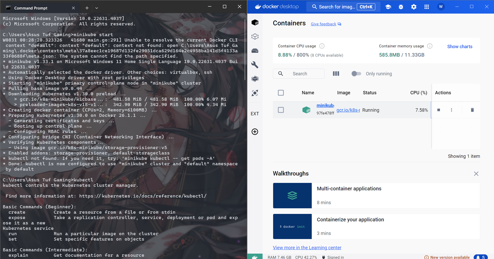
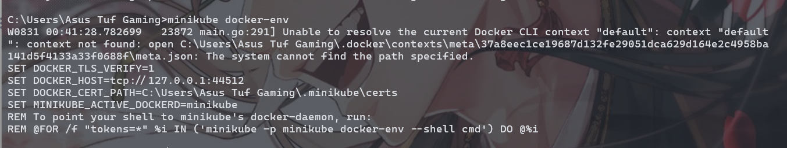
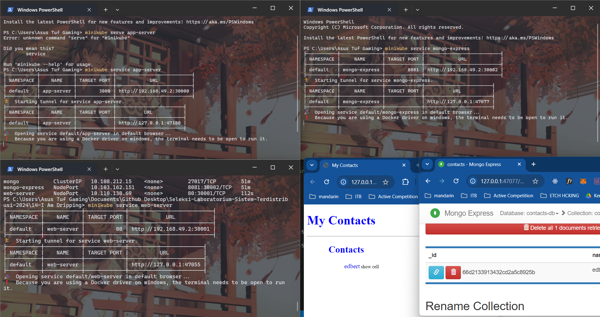

# I Am Dripping HOT

Again, i dont have any credits :(
**This is a stateful app**. The source code program is taken from https://github.com/CumulusCycles/Docker_Hub_Demo (credit).
This is the same project being deployed on 15-Pelabuhan.
However, the `k8s/*` resulted from translating the `docker-compose.yml` 

## Setting Up Minikube

1. Run `minikube start` start intance in docker




2. Run `minikube docker-env` using docker-cli



## push image to docker hub
build images

```bash
docker build -t app-server:latest ./app-server
docker build -t web-server:latest ./web-server
```

add tags to docker hub repo

```bash
docker tags app-server wazeazure/app-server:latest
docker tags web-server wazeazure/web-server:latest
```

push to docker hub

```bash
docker push wazeazure/app-server:latest
docker push wazeazure/web-server:latest
```

## Setting up kubernetes & project
apply kubernetes manifest
```yaml
kubectl apply -f app-server/k8s/app-server-deployment.yaml
kubectl apply -f web-server/k8s/web-server-deployment.yaml
kubectl apply -f mongo/k8s/mongo-deployment.yaml
kubectl apply -f mongo/k8s/mongo-pvc.yaml
kubectl apply -f mongo-express/k8s/mongo-express-deployment.yaml
```

## Final Result



3 Tier application on minikube kubernetes