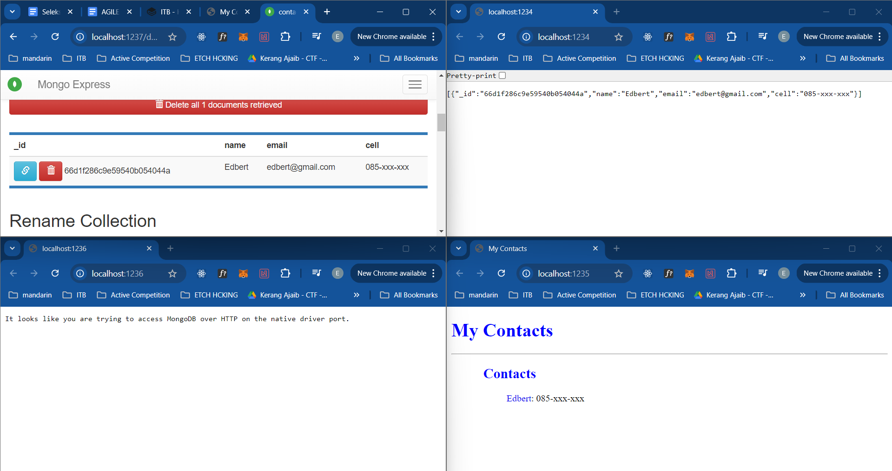

# 15 - Pelabuhan 

Sadly, i don't have any cloud credit (alrdy used all for ctf).

The project is taken from https://github.com/CumulusCycles/Docker_Hub_Demo (credit).
It both contains the source code, Dockerfile, and steps to run.
However, I will re-explain with my own words. with a few modification on ports assigning.

## Description
This project consist of 3 layer which are
- a simple Front End webpage using nginx
- an app layer running nodejs
- a databse using mongodb

## How to Run

`docker compose up --build`

## Full Explanation

image of the 3 tier architecture.

### docker-compose.yml

This docker-compose.yml file sets up a multi-container application with four services (app-server, web-server, mongo, and mongo-express). Here's a concise breakdown:

1. **Services**:
   1. **app-server**:
      1. Builds from the local ./app-server folder using the Dockerfile.
      2. Exposes port 1234 on the host mapped to port 3000 in the container (Node.js app).
      3. Environment variables: MongoDB credentials.
      4. Connected to the app-network.
   2. **web-server**:
      1. Builds from the local ./web-server folder using the Dockerfile.
      2. Exposes port 1235 on the host mapped to port 80 in the container (Nginx server).
      3. Connected to the app-network.
   3. **mongo**:
      1. Uses the official mongo image.
      2. Exposes port 1236 on the host mapped to port 27017 in the container (MongoDB service).
      3. Environment variables: MongoDB root credentials.
      4. Stores data in a Docker volume (app-volume) for persistence.
      5. Connected to the app-network.
   4. **mongo-express**:
      1. Uses the official mongo-express image.
      2. Exposes port 1237 on the host mapped to port 8081 in the container (MongoDB admin interface).
      3. Environment variables: Credentials and connection details for MongoDB.
      4. Always restarts if it fails.
      5. Connected to the app-network.
2. **Volumes**:
   1. app-volume: A local volume to persist MongoDB data across container restarts.
3. **Networks**:
   1. app-network: A custom bridge network that connects all services, allowing them to communicate with each other by name.

### app-server/Dockerfile
This Dockerfile provides instruction to copy the app-server source code and then run the program

1. **Base Image**:
   1. FROM node:alpine: Uses the official Node.js image, based on Alpine Linux. This is a minimal image that provides a smaller footprint, which is efficient in terms of size and performance.
2. **Environment Variables**:
   1. ENV MONGO_DB_USERNAME=root \ MONGO_DB_PWD=password: Sets environment variables for MongoDB credentials (root user and password). These variables will be available inside the container, allowing the application to connect to a MongoDB instance.
3. **Working Directory**:
   1. WORKDIR /src: Sets the working directory inside the container to /src. This is where subsequent commands (like COPY and RUN) will be executed. If the directory doesn't exist, it will be created.
4. **Copy Package File**:
   1. COPY ./src/package.json .: Copies the package.json file from your local ./src directory to the container's /src directory. This file contains all the dependencies and metadata for your Node.js application.
5. **Install Dependencies**:
   1. RUN npm install: Runs npm install inside the container to install all the dependencies listed in the package.json file. This is done after copying the package.json to ensure that Docker can cache this step and avoid reinstalling dependencies if only the application code changes (not the dependencies).
6. **Copy Application Code**:
   1. COPY ./src/ .: Copies the rest of the application code from your local ./src directory into the container's /src directory. This includes your Node.js files, such as server.js.
7. **Expose Port**:
   1. EXPOSE 3000: Informs Docker that the application will listen on port 3000 inside the container. This is not a port binding but a declaration of the port that the application uses.
8. **Start the Application**:
   1. CMD ["node", "server.js"]: Specifies the command to run when the container starts. In this case, it runs the Node.js application by executing server.js with Node.

### web-server/Dockerfile
This Dockerfile is designed to create a Docker image for serving a static website using the Nginx web server. Here's a concise breakdown of each instruction:

1. **Base Image**:
   1. FROM nginx:latest: This pulls the latest official Nginx image from Docker Hub. Nginx is a popular, high-performance web server that can be used to serve static files (HTML, CSS, JavaScript) or act as a reverse proxy.
2. **Copy Static Files**:
   1. COPY ./src/ /usr/share/nginx/html/: This copies the contents of your local ./src/ directory (which should contain your static website files like HTML, CSS, and JavaScript) into the container's /usr/share/nginx/html/ directory.
   2. /usr/share/nginx/html/ is the default directory where Nginx serves files from, so by placing your files here, Nginx will automatically serve them when the container runs.
3. **Expose Port**:
   1. EXPOSE 80: This informs Docker that the container will listen on port 80, which is the default HTTP port. This doesn't actually bind the port but serves as metadata to indicate that the service inside the container will use this port.