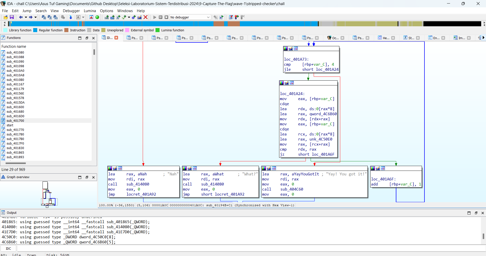
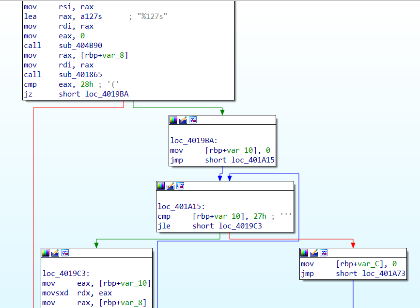

# Stripped Checker

**FLAG:** `Sister{sTr1pp3d_b1n4Ry5_w0nT_sT0p_m333!}`

Diberikan sebuah challenge mengenai `stripped elf` dia akan mengecek flag. sesuai inputan kita. 

Buka pake IDA pro, dan kita cari2 setengah mati. Intinya dapat ini



Sangat sus bukan? jadi akhirnya kita tahu bahwa offset dari fungsi checker ini ada di 

`0x40194B` --> nerima input user lalu cek jika len 40 atau tidak

Bisa dilihat nge `cmp eax, 0x28`. Tujuan kita harus ke kanan. dan so on (bisa diliat sendiri offset2 yg penting.)

Inti challenge ini adalah pada fungsi offset `0x401893` yang rotate hex sebanyak x bit. done.

**TERIMAKASIH KEPADA CHATGPT YG DAH BANTU BACA ASM nya HEHE**
https://chatgpt.com/share/9063d9af-c2d2-424c-b7d6-6be22ccbde86


```python
hex1 = "b4b9ba32b93db9a9" # 8
hex2 = "f547231707033645"
hex3 = "a4f26abec462dc68"
hex4 = "d50c1dcc1b9517dc"
hex5 = "7d705f6d33333321"

hex1_rev = "5369737465727b73"
hex2_rev = "547231707033645f"

payload = bytes.fromhex(hex1)
payload = b'a' + payload + b'a' * (8 * 2 - 1) + b'b' * (8 * 1) +  b'c' * 8

def convert_hex(h, x):
    mask = (1 << x) - 1
    b = int.from_bytes(bytes.fromhex(h), 'big')  # Convert hex string to integer
    temp = b & mask  # Extract the x least significant bits
    b >>= x  # Right shift the original number by x bits
    b = (temp << (63 - x + 1)) | b  # Shift the temp left and OR with the shifted b

    # Calculate the byte length and convert back to bytes
    byte_length = (b.bit_length() + 7) // 8  # Calculate necessary byte length
    return b.to_bytes(byte_length, 'big')

print(convert_hex(hex1, 7))
print(bytes.fromhex(hex1_rev))
print(convert_hex(hex2, 0x3c))
print(bytes.fromhex(hex2_rev))
# pertama itu 0x7, call sister
# kedua itu 0x3c,
# ketiga itu 0x21
# keeempat it 0x2e
# kelima itu 0x38

# '0x99199a1a9b1b9c18'
# '0x99199a1a9b1b9c18' '0xdadcdee0d2d4d6d8' '0x9dde1c5c9cdd1d5d' '0x2a21402324255e26'
# '0x3132333435363738' '0x6162636465666768' '0x696a6b6c6d6e6f70' '0x7172737475767778'
payload = convert_hex(hex1, 7) + convert_hex(hex2, 0x3c) + convert_hex(hex3, 0x21) + convert_hex(hex4, 0x2e) + convert_hex(hex5, 0x38)
#       0x99199a1a9b1b9c18                          *&^%$#@! --> &^%$#@!*
#       99199a1a9b1b9c18
f = open('input', 'wb')
f.write(payload)
f.close()
```